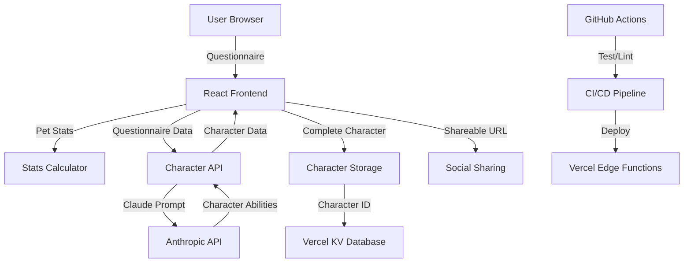
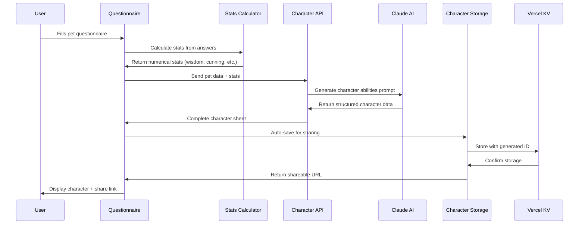
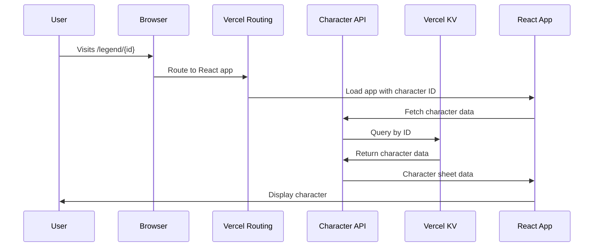

# CatStats Architecture Overview

_A comprehensive guide to understanding how CatStats transforms pets into RPG legends_

**Last Modified**: August 29, 2025

## Table of Contents

- [What CatStats Does](#what-catstats-does)
- [High-Level Architecture](#high-level-architecture)
- [Key Lego Pieces](#key-lego-pieces)
- [Data Flow](#data-flow)
- [API Integration](#api-integration)
- [Build & Deployment Pipeline](#build--deployment-pipeline)
- [Development Workflow](#development-workflow)

---

## What CatStats Does

CatStats is a **pet personality analyzer** that generates RPG-style character sheets for pets. Think of it as "D&D character creator but for your cat." The app takes behavioral questionnaire responses, calculates personality stats, and uses AI to generate unique abilities, weaknesses, and character descriptions.

### Core User Journey

```
Pet Owner → Fills Questionnaire → AI Generates Character → Shareable Legend
```

---

## High-Level Architecture



**Architecture Style**: Single Page Application (SPA) with serverless functions

- **Frontend**: React 18 + TypeScript + Vite
- **Backend**: Vercel Edge Functions (serverless)
- **Database**: Vercel KV (Redis-compatible)
- **AI**: Anthropic Claude API
- **Hosting**: Vercel with edge deployment

---

## Key Lego Pieces

### 🎯 Core Business Logic

#### **Stats Calculator** (`src/core/personality/statsCalculator.ts`)

- **What it does**: Converts questionnaire answers into numerical pet stats
- **Input**: User answers from multiple choice questions
- **Output**: Seven core stats (wisdom, cunning, agility, stealth, charisma, resolve, boldness)
- **Logic**: Starts with base stats (50 each), applies modifiers from selected answers

#### **Character Data Generator** (`src/services/api/characterApi.ts`)

- **What it does**: Takes pet stats + behavioral inputs and generates RPG abilities via AI
- **Input**: Pet name, questionnaire answers, calculated stats
- **Output**: Complete character sheet with abilities, weaknesses, archetype
- **Process**: Constructs Claude prompt → validates JSON response → returns structured data

### 🎨 User Interface Components

#### **PetPersonalityAnalyzer** (`src/components/PetPersonalityAnalyzer.tsx`)

- **Role**: Main application controller
- **Responsibilities**: State management, step orchestration, URL routing
- **States**: `questionnaire` → `result` → `showdown`
- **Key Features**: Handles shared character URLs, loading states, error boundaries

#### **QuestionnaireForm** (`src/components/Questionnaire/`)

- **What it does**: Multi-step form for collecting pet personality data
- **Components**: Multiple choice + open-ended questions, photo upload
- **Validation**: Ensures required fields completed before submission

#### **CharacterSheet** (`src/components/Results/CharacterSheet.tsx`)

- **What it does**: Displays generated character with stats visualization
- **Features**: Radar chart, abilities cards, sharing functionality, download options
- **Theme System**: Color schemes based on dominant personality traits

#### **AnimatedShareCard** (`src/components/Results/AnimatedShareCard/`)

- **Purpose**: Creates animated reveal sequence for social sharing
- **Phases**: Intro → Analyzing → Stats → Combat → Environmental → Social → Passive → Weakness → Signoff
- **Output**: Canvas-rendered shareable image

### 🔧 Infrastructure & Storage

#### **Character Storage** (`src/services/characterStorage.ts`)

- **Function**: Generates shareable links for completed character sheets
- **Process**: Generate 6-char ID → save to Vercel KV → return shareable URL
- **URLs**: `https://app.com/legend/{id}` format for social sharing

#### **API Functions** (`api/` directory)

- **character.js**: Proxy to Anthropic API with validation and rate limiting
- **save-character.js**: Stores character data in Vercel KV database
- **character/[id].js**: Retrieves shared characters by ID
- **Security**: API key validation, request structure validation, error handling

### 🧪 Testing & Quality

#### **Test Structure** (`src/test/`)

- **Core Logic Tests**: Stats calculation, compatibility algorithms, validation
- **Service Tests**: Character storage, API integration, export functionality
- **Philosophy**: Test business logic, not UI interactions
- **Coverage**: Focused on functions that would break the core user experience

---

## Data Flow

### Primary Flow: Creating a Character



### Secondary Flow: Loading Shared Characters



---

## API Integration

### Anthropic Claude Integration

**Purpose**: Generate creative character abilities based on pet personality data

**Flow**:

1. **Frontend** constructs prompt with pet details and behavioral responses
2. **Proxy API** (`/api/character`) validates request and forwards to Claude
3. **Claude API** returns structured JSON with character abilities
4. **Validation layer** ensures proper data format before sending to frontend

**Prompt Engineering**:

- Strict JSON format requirements
- Game mechanics focus (stats, success rates, durations)
- Personality-driven ability generation
- Creative archetype naming

**Error Handling**:

- API key validation
- Request structure validation
- JSON parsing with fallback
- User-friendly error messages

### Vercel KV Database

**Purpose**: Store generated characters for sharing functionality

**Data Model**:

```typescript
interface StoredCharacter {
  id: string; // 6-char alphanumeric
  created: string; // ISO timestamp
  petName: string;
  stats: PetStats;
  characterData: CharacterData;
  petPhoto?: string;
}
```

**Operations**:

- **Save**: Generate unique ID, store character data
- **Load**: Retrieve by ID for shared URLs
- **Collision Handling**: Retry with new ID if collision occurs

---

## Build & Deployment Pipeline

### Development Tools

**Local Development**:

- `npm run dev` - Vite dev server with HMR
- `vercel dev` - Full-stack development with API functions
- Hot reloading for instant feedback

**Code Quality**:

- **Husky**: Pre-commit hooks (format + lint on staged files)
- **ESLint**: Code linting with React-specific rules
- **Prettier**: Consistent code formatting
- **TypeScript**: Type safety and IntelliSense

### CI/CD Pipeline


**GitHub Actions** (`.github/workflows/ci.yml`):

- Triggers on push and pull requests
- Matrix testing on Node.js 18.x and 20.x
- Runs: `npm ci` → `npm run lint` → `npm run typecheck` → `npm test`

**Vercel Deployment**:

- Automatic deployment on push to main
- Edge function deployment for API routes
- Environment variable management for API keys
- Custom routing for shareable URLs

**Build Process**:

1. **TypeScript Compilation**: `tsc -b` - Type checking and compilation
2. **Vite Build**: Bundle optimization and asset processing
3. **API Functions**: Deploy as Vercel Edge Functions
4. **Static Assets**: CDN deployment with caching headers

---

## Development Workflow

### Getting Started

```bash
# Development server (frontend only)
npm run dev

# Full-stack development with API
vercel dev

# Run tests
npm test

# Code quality checks
npm run lint && npm run typecheck
```

### File Organization Philosophy

**Domain-Driven Structure**:

- `src/core/` - Pure business logic (stats, personality analysis)
- `src/components/` - UI components organized by feature
- `src/services/` - External integrations and utilities
- `api/` - Serverless functions for backend operations

**Separation of Concerns**:

- **Core**: No dependencies on UI or external services
- **Components**: Focus on presentation and user interaction
- **Services**: Handle external APIs and data persistence
- **API Functions**: Thin layer for proxying and validation

### Key Development Principles

1. **Simple > Clever**: Readable, maintainable code over complex optimizations
2. **Test Core Logic**: Focus tests on business rules and calculations
3. **Type Safety**: Leverage TypeScript for catching errors early
4. **Progressive Enhancement**: App works without JavaScript for basic functionality
5. **Mobile-First**: Responsive design with touch-friendly interactions

---

_This architecture documentation is designed to help you (or future collaborators) quickly understand how CatStats fits together and where to make changes when working with Claude Code._
